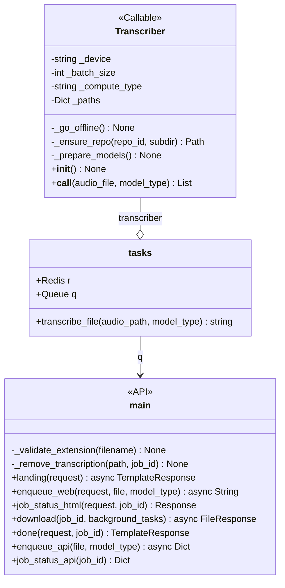
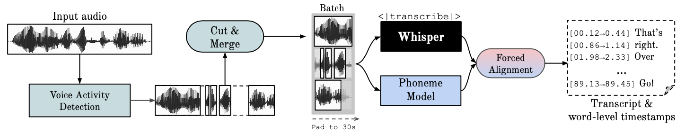
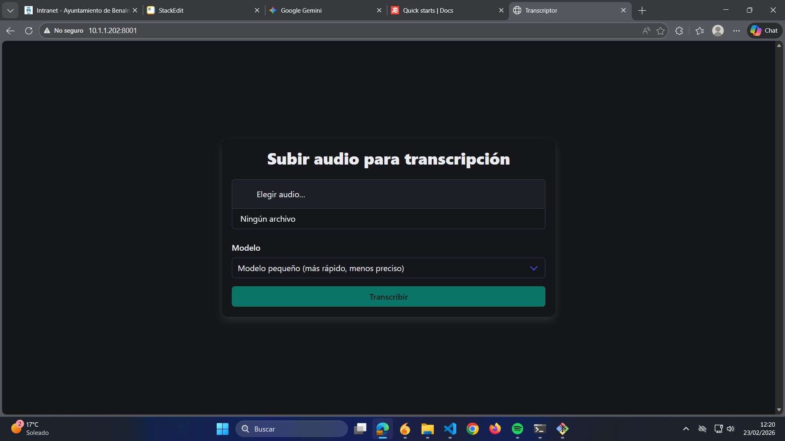

# Documentación aplicación transcriptora de audio

## Overview
El problema que pretendemos resolver con la aplicación que tenemos entre manos es el de **transcripción automática de audios**. Para ello, usaremos una pipeline open-source conocida como whisperX, la cual se puede encontrar en [m-bain/whisperX: WhisperX: Automatic Speech Recognition with Word-level Timestamps (& Diarization)](https://github.com/m-bain/whisperX). La problemática es que no debemos comunicar datos de audio de dentro del ayuntamiento ya que pueden ser de naturaleza sensible; por otra parte, necesitamos aplicar **diarización**, esto es, identificar a cada uno de los interlocutores. Contará con una interfaz web para su interactividad a través de dispositivos de bajos recursos.

Un aspecto importante a tener en cuenta es que, a diferencia de la aplicación de scraping (en el caso de haberse leído su documentación), aquí sí que podríamos tener, en principio, múltiples usuarios pidiendo servicio. Debido a que nuestros recursos son limitados, y que, a priori, no deberíamos tener muchas peticiones simultáneas (por lo que nos interesa más permitir el acceso de la tarea a la mayor cantidad de cómputo posible para agilizar el procesamiento de los modelos), el esquema concurrente es meramente una **cola** y solo podrá haber un proceso al mismo tiempo, pero se mantendrán las diferentes peticiones para ir procesándolas en orden de entrada.

## Detalles de la implementación a nivel de sistemas
| | |
|--|--|
| **Servidor desde el que se ejecuta** | 10.1.1.202 (servidoria) |
| **Puerto que expone la API** | 8001 |
| **Ruta en donde se encuentra el código** | /opt/transcriber/ |
| **Nombre del servicio diario** | nexus_scraper.service |
| **Nombre del servicio para exposición de la API** | transcriber.service |
| **Nombre del servicio que ejecuta el servidor Redis** | redis.service |
| **Nombre del servicio que ejecuta el worker de RQ** | rq-worker-transcriber.service |
| **Ruta de los ficheros de configuración de los servicios** | /etc/systemd/system/ |
| **Ruta del entorno virtual de Python con las dependencias del proyecto** | /home/administrador/.pyenv/versions/transcriptor/ |

## Implementación a nivel de programación

### Árbol de ficheros del proyecto

A continuación se presenta la estructura del directorio /opt/vink desde donde cuelga todo el código del proyecto:

- **/logs/** Para guardar logs de la aplicación.
- **/models/** Aquí están los modelos de deep learning (sus parámetros), que se cargarán a memoria cuando sea necesario procesar una transcripción.
- **/static/** Elementos CSS del proyecto.
	- **/spinner.css** Es meramente una rueda de progreso animada.
- **/templates/** Directorio del que cuelgan las plantillas html.
	- **/base.html** Contiene las cabeceras y es la plantilla base de las que heredan las demás, de manera que el código HTML de cada vista específica está encerrado en la estructura contenedora definida por medio de tags ```<div>```.
	- **/index.html** Página principal que actúa como root. Es, fundamentalmente, un único formulario con tres partes bien definidas: un ```<input>``` para ficheros, un ```<select>``` para elegir el modelo de deep learning a utilizar, y un ```<button>``` para lanzar el proceso. 
	- **/done.html** Aparece cuando el proceso ha finalizado. Permite la descarga de la transcripción generada.
	- **/job.html** Muestra el progreso de la tarea de transcripción.
- **/transcripts/** Directorio donde se guardan las transcripciones generadas.
- **/uploads/** Directorio donde se guardan los audios subidos a través de la API.
- **/main.py** Código de la API que expone los diferentes endpoints para la interactividad a través de interfaz web. Se usan diferentes librerías que se comentaran más adelante.
- **/tasks.py** Se encarga de mantener la cola que lanza las tareas asíncrona de transcripción con un pequeño procesamiento del texto resultante.
- **/transcriber.py** Contiene la clase que abstrae al transcriptor, de forma que aquí es donde especificamos toda la pipeline transcriptora y es lo que lanza ```tasks.py```.

### Diagrama de clases
Aquí hay que hacer una puntualización, y es que ```tasks.py``` y ```main.py``` no son clases, y las relaciones no representan tampoco realmente relaciones UML estándar. Más bien, este diagrama de clases es algo informal en el sentido de que sirve para entender qué componentes tenemos y cómo se comunican entre ellos. La relación de agregación de ```Transcriber``` con tasks aparece cuando se llama a la función ```tasks::transcribe_file()```, ```transcriber: Transcriber``` es solo una variable que se crea en la propia función (porque es un ```Callable```). Por su parte, ```q``` es una variable de ```tasks.py``` que estamos compartiendo explícitamente con ```main.py``` (que, en realidad, sí que es más cercano a una relación de asociación per se). Por último, determinadas funciones que aparecen como pertenecientes a la clase ```Transcriber``` en realidad están definidas fuera de ella (pero dentro del fichero ```transcriber.py```):



### Flujo de la computación del backend
Vamos a comenzar inspeccionando la clase ```Transcriber```. En realidad, es una clase bastante simple que meramente abstrae una llamada a la pipeline transcriptora. Primeramente, revisamos el constructor ```Transcriber::__init__()```:

```python
def __init__(self) {
	# Función ficticia que viene a decirnos que los atributos de Transcriber
	# se inicializan con valores por defecto, ya que no esperamos que
	# los usuarios tengan conocimientos sobre tamaños de batch...
	default_parameter_initialization();

	_prepare_models();
	_go_offline();
}
```

A parte de los parámetros para la ejecución de la transcripción, tenemos que comprobar que tenemos los modelos de deep learning en local, lo cual hacemos con las funciones arriba mentadas. No tienen mucha complicación ya que simplemente realizan esa comprobación para minimizar el acceso a internet, a priori mientras la carpeta ```./models``` no se toque no debería haber problemas. Pasamos ahora a investigar ```Transcriber::__call__()```:

```python
def __call__(self, audio_file, model_type) -> List<str, List>{
	model_name <- SMALL if model_type == "small" else LARGE;
	path <- SMALL_PATH if model_type == "small" else LARGE_PATH;

	# ----------- 1. Cargar el modelo transcriptor -----------
	model <- load_model(model_name, ..., str(path));
	
	# ----------- 2. Transcripción en bruto -----------
	audio <- load_audio(audio_file);
	result <- model.transcribe(audio, ...);
	del model;

	# ----------- 3. Alineado -----------
	align_model, meta <- load_align_model(..., self._paths[ALIGN]);
	result <- align(result.segments, align_model, ...);
	del align_model;

	# ----------- 4. Diarización -----------
	diar <- DiarizationPipeline(...);
	spk <- diar(audio);
	del diar;

	return assign_word_speakers(spk, results);
}
```

Aquí hay un par de cosas que conviene explorar adecuadamente. Lo primero de todo, puede que no sea del todo obvio pero la variable ```path``` representa la ruta en donde se encuentra almacenado en disco el modelo de deep learning correspondiente. Como tal vez se pueda apreciar, no tenemos un único modelo sino que la pipeline pasa por varios; ```model_type``` determina únicamente el modelo transcriptor, pero luego tenemos además modelos de alineado y de diarización. Cuando dichos modelos han cumplido su función, los eliminamos de memoria (los modelos de deep learning son relativamente pesados). 

Pese a que la pipeline nos viene mayormente proporcionada por la librería WhisperX y es casi por completo transparente, conviene que sepamos exactamente qué estamos haciendo en cada paso. Primero, la transcripción es el paso más obvio, la cual se produce con una de las variantes del modelo transcriptor open source de OpenAI, Whisper. El detalle técnico aquí es que, aunque Whisper proporciona transcripciones en bruto de mucha calidad, los timestamps correspondientes son a nivel de enunciado, no de palabra, y dichos timestamps puede ser erróneos para un cierto margen de segundos como resultado. Aquí entra el modelo de detección de fonemas (o de alineado, como lo denominamos en nuestro proyecto), un modelo de deep learning especializado en detectar la unidad mínima dentro de una secuencia de audio de lenguaje natural que diferencia a una palabra de otra (la "p" en la palabra "tap", por ejemplo). Usamos el modelo estándar ```VOXPOPULI_ASR_BASE_10K_ES```. Tras la transcripción, WhisperX se encarga de "forzar el alineamiento" entre la transcripción ortográfica producida por el modelo transcriptor y la segmentación a nivel de fonema del modelo de alineado. 



La última parte es la diarización. Esta parte sí es particularmente relevante ya que forma parte de nuestros requisitos. En ella, la segmentación a nivel de fonema se convierte a una segmentación a nivel de interlocutor detectado, por medio de un toolkit que, en este caso, sí nos proporciona la propia librería (el cual es ```pyannote-audio```). La variable ```spk``` se refiere a los interlocutores detectados por la diarización, que se combinan con los segmentos obtenidos por el alineado. El objeto devuelto es un ```AlignedTranscriptionResult```. Explorando la documentación de WhisperX, tenemos que:

```python
class AlignedTranscriptionResult(TypedDict) {
	"""
	A list of segments and word segments of a speech.
	"""
	segments: List[SingleAlignedSegment]
	word_segments: List[SingleWordSegment]
}

class SingleAlignedSegment(TypedDict) {
    """
    A single segment (up to multiple sentences) of a speech with word alignment.
    """
    start: float
    end: float
    text: str
    avg_logprob: NotRequired[float]
    words: List[SingleWordSegment]
    chars: Optional[List[SingleCharSegment]]
}
```

Hay que notar que los atributos de relevancia para cuando procesemos nuestro output son ```AlignedTranscriptionResult::segments``` y ```SingleAlignedSegment::text```. Vamos a pasar ahora a revisar ```tasks.py```, que contiene el código encargado de lanzar la tarea transcriptora. Específicamente, vamos a ver la función ```transcribe_file()```:

```python
def transcribe_file(audio_path, model_type) -> str {
	transcriber <- Transcriber();
	out <- transcriber(audio_path, model_type);

	transcription <- "";
	for segment in out.segments {
		speaker <- segment.get_speaker();
		text <- segment.text;
		transcription <- transcription + process_segment(speaker, text);
	}

	file_path <- str(TRANSCRIPT_DIR, JOB_ID, ".txt");
	save(file_path, transcription);
	remove(audio_path);

	return file_path;
}
```

Como se puede ver, esta función simplemente lanza una tarea transcriptora (recordemos que ```Transcriber``` es un ```Callable```), realiza un pequeño procesamiento a la transcripción, elimina el audio original de disco y devuelve el path del fichero generado. Dicho procesamiento consiste meramente en cambiar el formato del interlocutor de ```"SPEAKER_XX"``` a ```"Persona XX"``` para que sea más legible en español. Un ejemplo de fichero de transcripción podría ser el siguiente:

```
.
.
.
[Persona 06]: Bueno, vamos entrando, vamos a empezar.

[Persona 00]: El mazo, yo no sé.

[Persona 00]: Esto no suena mucho.

[Persona 01]: Una.

[Persona 01]: Ay, mira, este tipo...

[Persona 00]: A ver, una preguntilla.

[Persona 00]: De la sesión anterior, tengo 71 firmas y hoy solo tengo 70.

[Persona 00]: O sea, que alguien del que vino el martes no ha venido hoy o no ha firmado.

[Persona 00]: Lo digo porque no le va a servir para nada, pero que tengo una firma menos.

[Persona 00]: No faltáis de lo que estáis aquí, no faltáis, ¿no?

[Persona 00]: Ninguno.
.
.
.
```

### Flujo de la computación del frontend

La aplicación expone una interfaz web en ```http://10.1.1.202:8001``` para poder realizar peticiones de transcripción al servidor.



Como se mencionó con anterioridad, necesitamos algún tipo de esquema concurrente que nos permita el manejo de peticiones web procedentes de diversos usuarios. El problema reside en que las peticiones HTTP tienen caducidad, por lo que necesitamos mantener en memoria una cola que escuche a las diversas peticiones que van entrando. La solución implementada consiste en levantar un servidor ```Redis```
