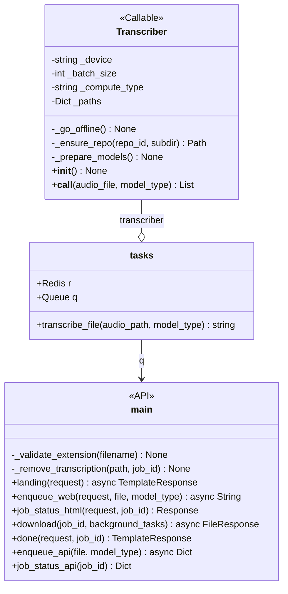
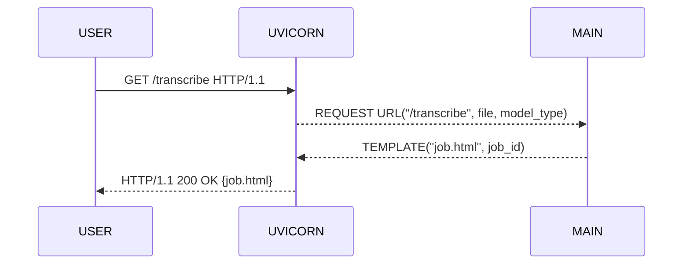
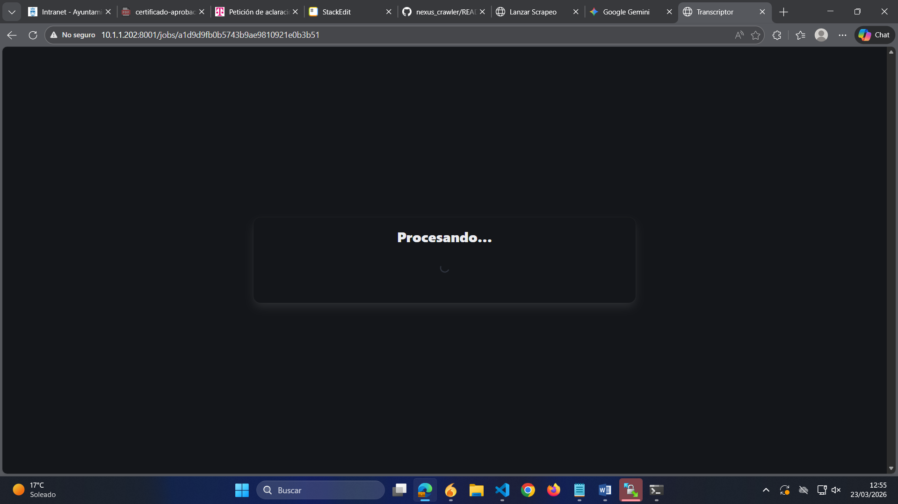
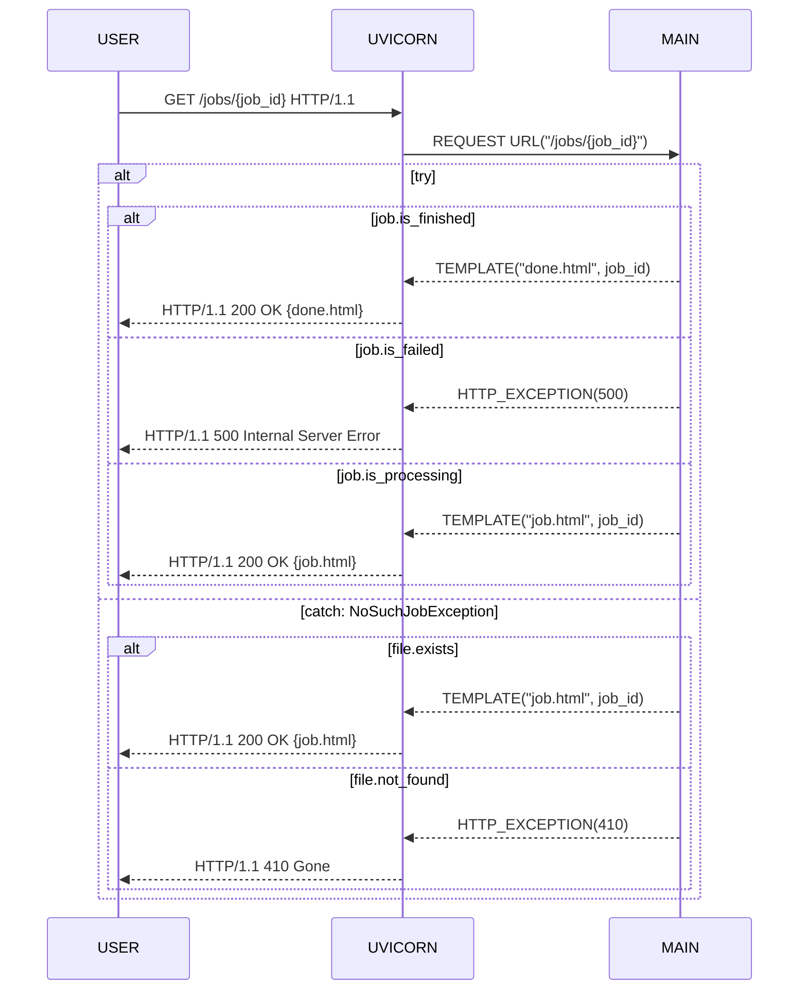
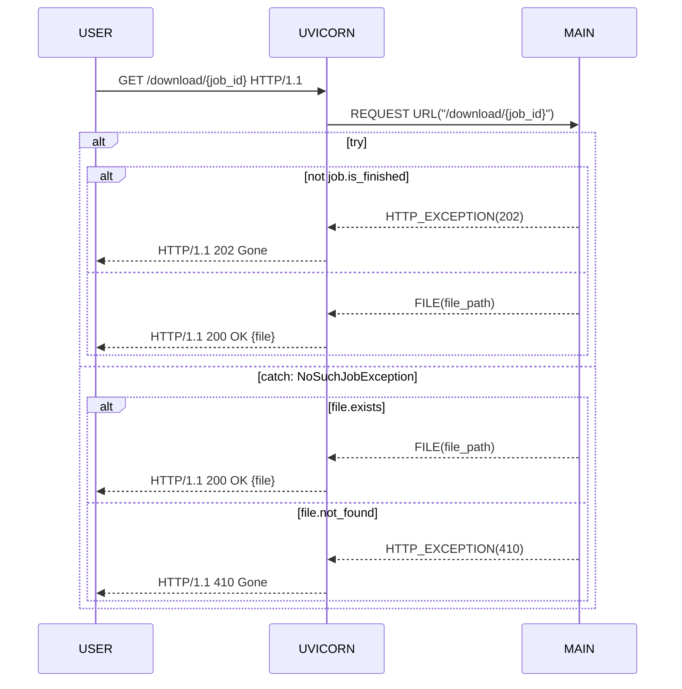
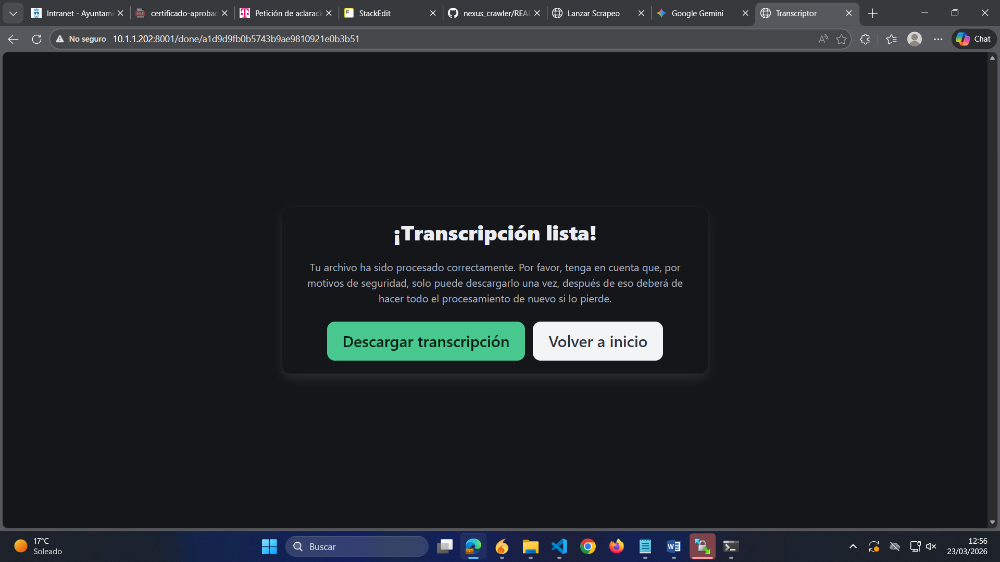

# Documentación aplicación transcriptora de audio

## Overview
El problema que pretendemos resolver con la aplicación que tenemos entre manos es el de **transcripción automática de audios**. Para ello, usaremos una pipeline open-source conocida como whisperX, la cual se puede encontrar en [m-bain/whisperX: WhisperX: Automatic Speech Recognition with Word-level Timestamps (& Diarization)](https://github.com/m-bain/whisperX). La problemática es que no debemos comunicar datos de audio de dentro del ayuntamiento ya que pueden ser de naturaleza sensible; por otra parte, necesitamos aplicar **diarización**, esto es, identificar a cada uno de los interlocutores. Contará con una interfaz web para su interactividad a través de dispositivos de bajos recursos.

Un aspecto importante a tener en cuenta es que, a diferencia de la aplicación de scraping (en el caso de haberse leído su documentación), aquí sí que podríamos tener, en principio, múltiples usuarios pidiendo servicio. Debido a que nuestros recursos son limitados, y que, a priori, no deberíamos tener muchas peticiones simultáneas (por lo que nos interesa más permitir el acceso de la tarea a la mayor cantidad de cómputo posible para agilizar el procesamiento de los modelos), el esquema concurrente es meramente una **cola** y solo podrá haber un proceso al mismo tiempo, pero se mantendrán las diferentes peticiones para ir procesándolas en orden de entrada.

Hay un apunte **importante** a tener en cuenta, y es que, a nivel de uso, el usuario **debe** tener cuidado de no perder la URL con el ID de su tarea (de la forma ```http://10.1.1.202:8001/jobs/855f7b05bef14b3b86e4b1fc5bd73852```), ya que no tendrá manera de acceder a su tarea en progreso si la pierde.

## Detalles de la implementación a nivel de sistemas
| | |
|--|--|
| **Servidor desde el que se ejecuta** | 10.1.1.202 (servidoria) |
| **Puerto que expone la API** | 8001 |
| **Ruta en donde se encuentra el código** | /opt/transcriber/ |
| **Nombre del servicio diario** | nexus_scraper.service |
| **Nombre del servicio para exposición de la API** | transcriber.service |
| **Nombre del servicio que ejecuta el servidor Redis** | redis.service |
| **Nombre del servicio que ejecuta el worker de RQ** | rq-worker-transcriber.service |
| **Ruta de los ficheros de configuración de los servicios** | /etc/systemd/system/ |
| **Ruta del entorno virtual de Python con las dependencias del proyecto** | /home/administrador/.pyenv/versions/transcriptor/ |

Para lanzar la aplicación, deberemos seguir los siguientes pasos:

1. Replicar el entorno virtual con ``pyenv``. Para ello, deberemos tener ``pyenv`` junto con ``pyenv-virtualenv`` en nuestro sistema debian, ejecutando lo siguiente:
  
  - Instalar dependencias de pyenv y pyenv-virtualenv: ``sudo apt install -y make build-essential libssl-dev zlib1g-dev libbz2-dev libreadline-dev libsqlite3-dev wget curl llvm libncurses5-dev libncursesw5-dev xz-utils tk-dev libffi-dev liblzma-dev git``
  - Instalamos propiamente ambas herramientas: ``curl https://pyenv.run | bash``
  - Agregar algunas líneas a la configuración de bash:
    ``echo 'export PYENV_ROOT="$HOME/.pyenv"' >> ~/.bashrc``
    ``echo 'command -v pyenv >/dev/null || export PATH="$PYENV_ROOT/bin:$PATH"' >> ~/.bashrc``
    ``echo 'eval "$(pyenv init -)"' >> ~/.bashrc``
    ``echo 'eval "$(pyenv virtualenv-init -)"' >> ~/.bashrc``
  - Recargar la configuración: `source ~/.bashrc`
2. Crear el propio entorno a partir del fichero ``requirements.txt``. Para ello, seguimos los siguientes pasos:
  
  - Creamos el entorno vacío de python 3.12: ``pyenv virtualenv 3.12 transcriptor``
  - Activamos el entorno: ``pyenv activate transcriptor``
  - Instalamos pip, que es la herramienta de manejo de librerías para python: ``sudo apt install pip``
  - Comprobamos que pip esté actualizado: ``pip install --upgrade pip``
  - Instalamos librerías con pip: ``pip install -r requirements.txt``

A continuación, deberemos tener disponible este repositorio de código en la máquina debian donde deseemos ejecutar la aplicación. Los ficheros de configuración están preparados para las rutas específicas que se han mencionado antes, de manera que, si no los modificamos, el código deberá estar en ``/opt/transcriber``, y toda la carpeta deberá pertener al usuario administrador, lo cual podemos hacer con ``sudo chown -R administrador:administrador /opt/transcriber``. De la misma forma, los ficheros de configuración también están preparados para hacerlo todo con el usuario administrador, de manera que deberemos tener pyenv en su home, no en el root.

Como ya veremos más adelante en los detalles de implementación, vamos a necesitar un servidor ``redis`` para mantener la cola de peticiones, así como un "worker" que esté a la escucha de dichas peticiones. Para ello, seguimos los siguientes pasos:
- Instalamos redis con ``sudo apt install redis``
- Copiamos el fichero de configuración del worker, ``rq-worker-transcriber.service``, a ``/etc/systemd/system``, con los permisos adecuados, ``sudo chmod 644 /etc/systemd/system/rq-worker-transcriber.service``
- Reiniciamos el demonio de systemctl, ``sudo systemctl daemon-reload``
- Habilitamos el servicio del worker con ``sudo systemctl enable --now rq-worker-transcriber.service``
- Reiniciamos redis para dejarlo ejecutándose, ``sudo systemctl restart redis.service``. Llegados a este punto, posiblemente salten errores al no tener la API levantada.

A continuación, tenemos que configurar el servicio de systemd que nos expone nuestra API:

- Primero, copiamos el fichero de configuración ``transcriber.service`` a ``/etc/systemd/system``
- A continuación, establecemos los permisos adecuados: ``sudo chmod 644 /etc/systemd/system/transcriber.service``
- Recargamos el demonio de systemctl para que se dé cuenta del nuevo fichero: ``sudo sytemctl daemon-reload``
- Lo habilitamos para que el servicio arranque siempre que la máquina también lo haga (con la opción --now para que también se inicie sin necesidad de reiniciar el servidor): ``sudo systemctl enable --now transcriber.service``. Para parar el servicio, ``sudo systemctl stop transcriber.service``, para reiniciarlo, ``sudo systemctl restart transcriber.service``
- Comprobamos su estado con ``sudo systemctl status transcriber.service``. Otra herramienta relevante es ``journalctl`` para leer los logs y ver si se producen errores; con la orden ``sudo journalctl -fu transcriber.service`` podemos ver los logs en tiempo real, y con ``sudo journalctl -u transcriber.service -n 100`` podemos ver las últimas 100 (o las que queramos) líneas de logs.
- Hay que tener en cuenta que el proceso lo que hace es lanzar un servidor web ``uvicorn`` desde el propio entorno de python y a través del puerto 8001, por lo que hay que asegurarse de que el puerto está expuesto.

NOTA: Para la descarga de los modelos se usa un token de huggingface, eso no es necesario si se tienen en local, como los tenemos en la carpeta ``/models``, pero hace falta configurar uno si no se tienen.

## Implementación a nivel de programación

### Árbol de ficheros del proyecto

A continuación se presenta la estructura del directorio /opt/vink desde donde cuelga todo el código del proyecto:

- **/config/** Directorio donde se encuentran los ficheros de configuración de systemd.
	- **/config/rq-worker-transcriber.service** Fichero de configuración para el worker de RQ encargado de estar a la escucha de peticiones de transcripción.
	- **/config/transcriber.service** Fichero de configuración de la API de uvicorn.
- **/env/** Directorio con las dependencias del proyecto.
	- **/env/requirements.txt** Librerías de pip necesarias para el entorno virtual de python.
- **/logs/** Para guardar logs de la aplicación.
- **/models/** Aquí están los modelos de deep learning (sus parámetros), que se cargarán a memoria cuando sea necesario procesar una transcripción.
- **/static/** Elementos CSS del proyecto.
	- **/spinner.css** Es meramente una rueda de progreso animada.
- **/templates/** Directorio del que cuelgan las plantillas html.
	- **/base.html** Contiene las cabeceras y es la plantilla base de las que heredan las demás, de manera que el código HTML de cada vista específica está encerrado en la estructura contenedora definida por medio de tags ```<div>```.
	- **/index.html** Página principal que actúa como root. Es, fundamentalmente, un único formulario con tres partes bien definidas: un ```<input>``` para ficheros, un ```<select>``` para elegir el modelo de deep learning a utilizar, y un ```<button>``` para lanzar el proceso. 
	- **/done.html** Aparece cuando el proceso ha finalizado. Permite la descarga de la transcripción generada.
	- **/job.html** Muestra el progreso de la tarea de transcripción.
- **/transcripts/** Directorio donde se guardan las transcripciones generadas.
- **/uploads/** Directorio donde se guardan los audios subidos a través de la API.
- **/main.py** Código de la API que expone los diferentes endpoints para la interactividad a través de interfaz web. Se usan diferentes librerías que se comentaran más adelante.
- **/tasks.py** Se encarga de mantener la cola que lanza las tareas asíncrona de transcripción con un pequeño procesamiento del texto resultante.
- **/transcriber.py** Contiene la clase que abstrae al transcriptor, de forma que aquí es donde especificamos toda la pipeline transcriptora y es lo que lanza ```tasks.py```.

### Diagrama de clases
Aquí hay que hacer una puntualización, y es que ```tasks.py``` y ```main.py``` no son clases, y las relaciones no representan tampoco realmente relaciones UML estándar. Más bien, este diagrama de clases es algo informal en el sentido de que sirve para entender qué componentes tenemos y cómo se comunican entre ellos. La relación de agregación de ```Transcriber``` con tasks aparece cuando se llama a la función ```tasks::transcribe_file()```, ```transcriber: Transcriber``` es solo una variable que se crea en la propia función (porque es un ```Callable```). Por su parte, ```q``` es una variable de ```tasks.py``` que estamos compartiendo explícitamente con ```main.py``` (que, en realidad, sí que es más cercano a una relación de asociación per se). Por último, determinadas funciones que aparecen como pertenecientes a la clase ```Transcriber``` en realidad están definidas fuera de ella (pero dentro del fichero ```transcriber.py```):



### Flujo de la computación del backend
Vamos a comenzar inspeccionando la clase ```Transcriber```. En realidad, es una clase bastante simple que meramente abstrae una llamada a la pipeline transcriptora. Primeramente, revisamos el constructor ```Transcriber::__init__()```:

```python
def __init__(self) {
	# Función ficticia que viene a decirnos que los atributos de Transcriber
	# se inicializan con valores por defecto, ya que no esperamos que
	# los usuarios tengan conocimientos sobre tamaños de batch...
	default_parameter_initialization();

	_prepare_models();
	_go_offline();
}
```

A parte de los parámetros para la ejecución de la transcripción, tenemos que comprobar que tenemos los modelos de deep learning en local, lo cual hacemos con las funciones arriba mentadas. No tienen mucha complicación ya que simplemente realizan esa comprobación para minimizar el acceso a internet, a priori mientras la carpeta ```./models``` no se toque no debería haber problemas. Pasamos ahora a investigar ```Transcriber::__call__()```:

```python
def __call__(self, audio_file, model_type) -> List<str, List>{
	model_name <- SMALL if model_type == "small" else LARGE;
	path <- SMALL_PATH if model_type == "small" else LARGE_PATH;

	# ----------- 1. Cargar el modelo transcriptor -----------
	model <- load_model(model_name, ..., str(path));
	
	# ----------- 2. Transcripción en bruto -----------
	audio <- load_audio(audio_file);
	result <- model.transcribe(audio, ...);
	del model;

	# ----------- 3. Alineado -----------
	align_model, meta <- load_align_model(..., self._paths[ALIGN]);
	result <- align(result.segments, align_model, ...);
	del align_model;

	# ----------- 4. Diarización -----------
	diar <- DiarizationPipeline(...);
	spk <- diar(audio);
	del diar;

	return assign_word_speakers(spk, results);
}
```

Aquí hay un par de cosas que conviene explorar adecuadamente. Lo primero de todo, puede que no sea del todo obvio pero la variable ```path``` representa la ruta en donde se encuentra almacenado en disco el modelo de deep learning correspondiente. Como tal vez se pueda apreciar, no tenemos un único modelo sino que la pipeline pasa por varios; ```model_type``` determina únicamente el modelo transcriptor, pero luego tenemos además modelos de alineado y de diarización. Cuando dichos modelos han cumplido su función, los eliminamos de memoria (los modelos de deep learning son relativamente pesados). 

Pese a que la pipeline nos viene mayormente proporcionada por la librería WhisperX y es casi por completo transparente, conviene que sepamos exactamente qué estamos haciendo en cada paso. Primero, la transcripción es el paso más obvio, la cual se produce con una de las variantes del modelo transcriptor open source de OpenAI, Whisper. El detalle técnico aquí es que, aunque Whisper proporciona transcripciones en bruto de mucha calidad, los timestamps correspondientes son a nivel de enunciado, no de palabra, y dichos timestamps puede ser erróneos para un cierto margen de segundos como resultado. Aquí entra el modelo de detección de fonemas (o de alineado, como lo denominamos en nuestro proyecto), un modelo de deep learning especializado en detectar la unidad mínima dentro de una secuencia de audio de lenguaje natural que diferencia a una palabra de otra (la "p" en la palabra "tap", por ejemplo). Usamos el modelo estándar ```VOXPOPULI_ASR_BASE_10K_ES```. Tras la transcripción, WhisperX se encarga de "forzar el alineamiento" entre la transcripción ortográfica producida por el modelo transcriptor y la segmentación a nivel de fonema del modelo de alineado. 


La última parte es la diarización. Esta parte sí es particularmente relevante ya que forma parte de nuestros requisitos. En ella, la segmentación a nivel de fonema se convierte a una segmentación a nivel de interlocutor detectado, por medio de un toolkit que, en este caso, sí nos proporciona la propia librería (el cual es ```pyannote-audio```). La variable ```spk``` se refiere a los interlocutores detectados por la diarización, que se combinan con los segmentos obtenidos por el alineado. El objeto devuelto es un ```AlignedTranscriptionResult```. Explorando el código de WhisperX, tenemos que:

```python
class AlignedTranscriptionResult(TypedDict) {
	"""
	A list of segments and word segments of a speech.
	"""
	segments: List[SingleAlignedSegment]
	word_segments: List[SingleWordSegment]
}

class SingleAlignedSegment(TypedDict) {
    """
    A single segment (up to multiple sentences) of a speech with word alignment.
    """
    start: float
    end: float
    text: str
    avg_logprob: NotRequired[float]
    words: List[SingleWordSegment]
    chars: Optional[List[SingleCharSegment]]
}
```

Hay que notar que los atributos de relevancia para cuando procesemos nuestro output son ```AlignedTranscriptionResult::segments``` y ```SingleAlignedSegment::text```. Vamos a pasar ahora a revisar ```tasks.py```, que contiene el código encargado de lanzar la tarea transcriptora. Específicamente, vamos a ver la función ```transcribe_file()```:

```python
def transcribe_file(audio_path, model_type) -> str {
	transcriber <- Transcriber();
	out <- transcriber(audio_path, model_type);

	transcription <- "";
	for segment in out.segments {
		speaker <- segment.get_speaker();
		text <- segment.text;
		transcription <- transcription + process_segment(speaker, text);
	}

	file_path <- str(TRANSCRIPT_DIR, JOB_ID, ".txt");
	save(file_path, transcription);
	remove(audio_path);

	return file_path;
}
```

Como se puede ver, esta función simplemente lanza una tarea transcriptora (recordemos que ```Transcriber``` es un ```Callable```), realiza un pequeño procesamiento a la transcripción, elimina el audio original de disco y devuelve el path del fichero generado. Dicho procesamiento consiste meramente en cambiar el formato del interlocutor de ```"SPEAKER_XX"``` a ```"Persona XX"``` para que sea más legible en español. Un ejemplo de fichero de transcripción podría ser el siguiente:

```
.
.
.
[Persona 06]: Bueno, vamos entrando, vamos a empezar.

[Persona 00]: El mazo, yo no sé.

[Persona 00]: Esto no suena mucho.

[Persona 01]: Una.

[Persona 01]: Ay, mira, este tipo...

[Persona 00]: A ver, una preguntilla.

[Persona 00]: De la sesión anterior, tengo 71 firmas y hoy solo tengo 70.

[Persona 00]: O sea, que alguien del que vino el martes no ha venido hoy o no ha firmado.

[Persona 00]: Lo digo porque no le va a servir para nada, pero que tengo una firma menos.

[Persona 00]: No faltáis de lo que estáis aquí, no faltáis, ¿no?

[Persona 00]: Ninguno.
.
.
.
```

Como se mencionó con anterioridad, necesitamos algún tipo de esquema concurrente que nos permita el manejo de peticiones web procedentes de diversos usuarios. El problema reside en que las peticiones HTTP tienen caducidad, por lo que necesitamos mantener en memoria una cola que escuche a las diversas peticiones que van entrando. La solución implementada consiste en levantar un servidor ```Redis```, el cual mantiene una cola de trabajos ``q:rq.Queue``. Tenemos al servicio ```rq-worker-transcriber.service``` siempre a la escucha de nuevas peticiones que van entrando y los cambios de estado de dichas peticiones, de manera que es el trabajador encargado de ejecutar las transcripciones cuando se producen los cambios de estado pertinentes. Por otro lado, el propio servidor ```Redis``` tiene también asociado un servicio ```redis.service```, el cual simplemente mantiene la cola de peticiones en memoria (mantiene una base de datos, fundamentalmente). El flujo de procesamiento para esta parte del backend se deja para el siguiente apartado, con el objetivo de ilustrar correctamente la lógica de comunicación con el frontend.

### Flujo de la computación del frontend

La aplicación expone una interfaz web en ```http://10.1.1.202:8001``` para poder realizar peticiones de transcripción al servidor.


El primer endpoint de nuestra API, ```/```, es bastante trivial y meramente llama a la función ```main::landing()```, que simplemente devuelve la vista principal ```index.html```. Dicha plantilla sí que tiene algo de código javascript, el cual añade un 'listener' que está a la escucha de cambios en el ```input``` de ficheros, de manera que el botón de 'submit' se activa si y solo si se ha subido un fichero, y también se realizan comprobaciones alrededor de la extensión del fichero; WhisperX acepta una gran cantidad de extensiones, vídeos incluidos, pero aún así nuestra aplicación cuenta con la lógica necesaria para asegurarnos de que el fichero subido es correcto, de manera que se mostrará un mensaje de error si esta condición no se cumple, y se bloqueará la ejecución de la transcripción.

El siguiente endpoint, el cual es no trivial y analizaremos con más detalle, es ```/transcribe```, que tiene asociado la función ```main::enqueue_web()```:





Merece la pena elaborar pseudocódigo para la función ```main::enqueue_web()``` para entender su lógica:

```python
def enqueue_web(upload_file, model_type) -> str {
	job_id <- generate_id();
	file_name <- upload_file.get_filename();
	dest <- join(UPLOAD_DIR, f"{job_id}_{file_name}");
	write(dest, upload_file.file);
	job <- q.enqueue(tasks.transcribe_file, 
						dest, model_type, job_id);
	return f"/jobs/{job.id}";
}
```

Básicamente, establece el trabajo, generando su ID, guarda el fichero recibido a través de la petición HTTP y encola dicho trabajo para que el 'worker' de ```Redis``` lo procese.

El siguiente endpoint se trata de ```/jobs/{job_id}```, que tiene el siguiente diagrama de secuencia:



La lógica es sencilla, simplemente se recupera el trabajo por medio de ```rq.Job::fetch()``` y se establecen los estados de error ilustrados para mantener la consistencia de la aplicación. En definitiva, este endpoint simplemente devuelve el estado del trabajo requerido, que puede estar bien en progreso, bien terminado, o bien con un estado de error.

El endpoint que se encarga de proporcionar la descarga del fichero de transcripción, ```/download/{job_id}```, que tiene asociado la función ```main::download()```, cuenta con el siguiente diagrama de secuencia:



El endpoint restante, ```/done/{job_id}```, es bastante trivial y simplemente devuelve la vista de tarea terminada.

